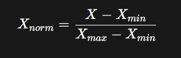
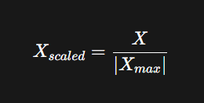

# 📊 Feature Scaling – Normalization (Basic to Advanced)

Feature scaling is a **data preprocessing technique** used in Machine Learning to bring all numerical features to a **similar scale** so that no single feature dominates the model due to its large magnitude.

* Clear definitions
* Mathematical formulas
* Easy real‑world examples
* When & where to use each technique

---

## 📌 Table of Contents

1. What is Feature Scaling?
2. What is Normalization?
3. Why Normalization is Important
4. Types of Normalization

   * Min-Max Scaling
   * MaxAbs Scaling
   * Robust Scaling
5. Comparison Table
6. Which Normalization to Use & When
7. Key Takeaways

---

## 1️⃣ What is Feature Scaling?

Feature Scaling is the process of **transforming numerical data** so that features lie within a **specific range or distribution**.

### ❌ Problem without scaling

| Feature | Example Values     |
| ------- | ------------------ |
| Age     | 18 – 65            |
| Income  | 20,000 – 10,00,000 |

👉 Income will dominate Age during model training.

### ✅ Solution

Scale both features so they contribute **equally**.

---

## 2️⃣ What is Normalization?

**Normalization** rescales feature values to a **fixed range**, usually **[0, 1]** or **[-1, 1]**.

📌 It preserves the **shape of the data distribution** while changing its scale.

---

## 3️⃣ Why Normalization is Important?

✔ Faster model convergence 
✔ Improves performance of distance‑based algorithms 
✔ Prevents large values from dominating 
✔ Required for gradient‑based optimization 

---

## 4️⃣ Types of Normalization

---

## 🔹 1. Min-Max Scaling

### 📖 Definition

Transforms data to a **fixed range [0, 1]**.

### 📐 Mathematical Formula

Where:

* X = original value
* Xmin = minimum value of feature
* Xmax = maximum value of feature

---

### 🌍 Real‑World Example

**Exam Scores:**
Scores = [40, 60, 80, 100]

For score = 60:
[
\frac{60 - 40}{100 - 40} = \frac{20}{60} = 0.33
]

📌 Output range → **0 to 1**

---

### ✅ When to Use Min‑Max Scaling

✔ When data has **no outliers**
✔ For **Neural Networks**
✔ For **image pixel normalization**
✔ When you need a **bounded range**

### ❌ When NOT to Use

✖ If data contains **outliers**

---

## 🔹 2. MaxAbs Scaling

### 📖 Definition

Scales data by dividing by the **maximum absolute value**, resulting in values between **[-1, 1]**.

---

### 📐 Mathematical Formula

Where:

* |Xmax| = maximum absolute value

---

### 🌍 Real‑World Example

**Stock Price Change (%):**
Values = [-20, -10, 0, 10, 20]

For value = -10:
[
\frac{-10}{20} = -0.5
]

📌 Output range → **[-1, 1]**

---

### ✅ When to Use MaxAbs Scaling

✔ When data is **centered at 0**
✔ For **sparse data** (NLP, TF‑IDF)
✔ When **sign matters** (+ / -)

### ❌ When NOT to Use

✖ If data has extreme outliers

---

## 🔹 3. Robust Scaling

### 📖 Definition

Uses **median** and **interquartile range (IQR)** instead of mean and standard deviation.

📌 Highly **robust to outliers**.

---

### 📐 Mathematical Formula

Where:

* IQR = Q3 − Q1

---

### 🌍 Real‑World Example

**House Prices (₹):**
[20L, 22L, 24L, 25L, 200L]

Median = 24L
IQR = 25L − 22L = 3L

For 25L:
[
\frac{25 - 24}{3} = 0.33
]

📌 Outlier (200L) has minimal effect

---

### ✅ When to Use Robust Scaling

✔ Data contains **outliers**
✔ Financial datasets
✔ Real‑world noisy data

### ❌ When NOT to Use

✖ When data is already clean and normalized

---

## 5️⃣ Comparison Table

| Scaling Method | Range    | Handles Outliers | Best For                   |
| -------------- | -------- | ---------------- | -------------------------- |
| Min‑Max        | [0,1]    | ❌ No             | Neural Networks, Images    |
| MaxAbs         | [-1,1]   | ❌ No             | Sparse Data, NLP           |
| Robust         | No fixed | ✅ Yes            | Financial, Real‑world data |

---

## 6️⃣ Which Normalization to Use & When?

| Scenario                 | Recommended Method |
| ------------------------ | ------------------ |
| Image pixel values       | Min‑Max            |
| NLP / Sparse matrices    | MaxAbs             |
| Financial data           | Robust             |
| Data without outliers    | Min‑Max            |
| Data with extreme values | Robust             |

---

## 7️⃣ Key Takeaways

✔ Normalization improves model stability
✔ Choose method based on **data distribution**
✔ Outliers → use **Robust Scaling**
✔ Neural Networks → prefer **Min‑Max**

---

📌 **Author:** Devrsh Shukla
📌 **Use Case:** Academic Projects | ML Practice | GitHub Portfolio

⭐ If you found this helpful, give the repo a **star**!
